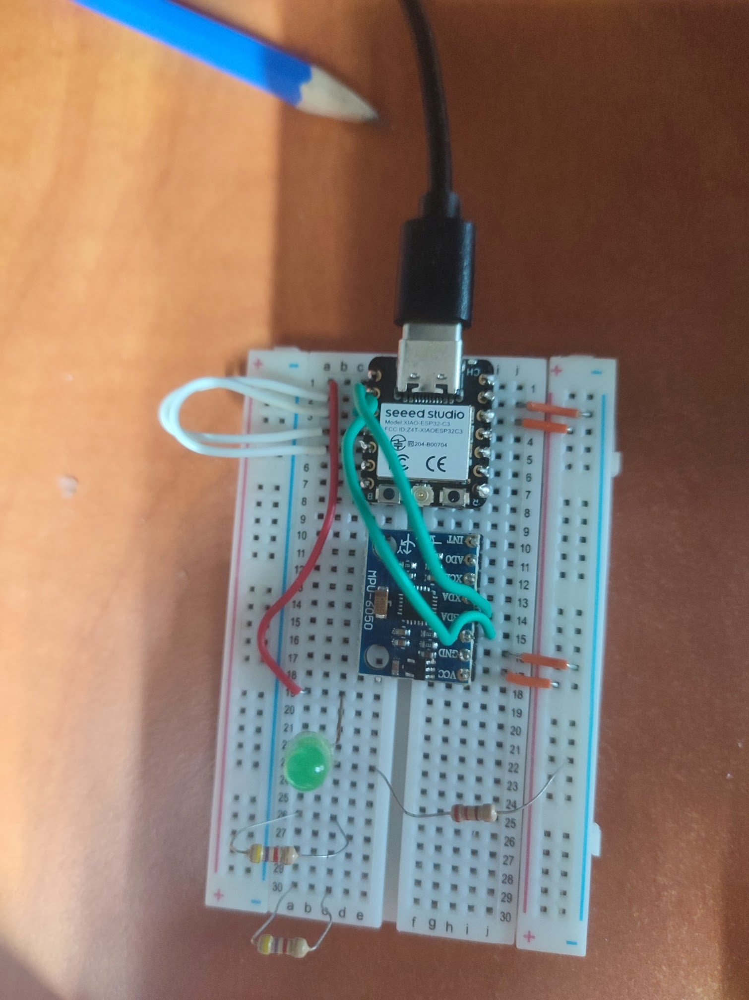
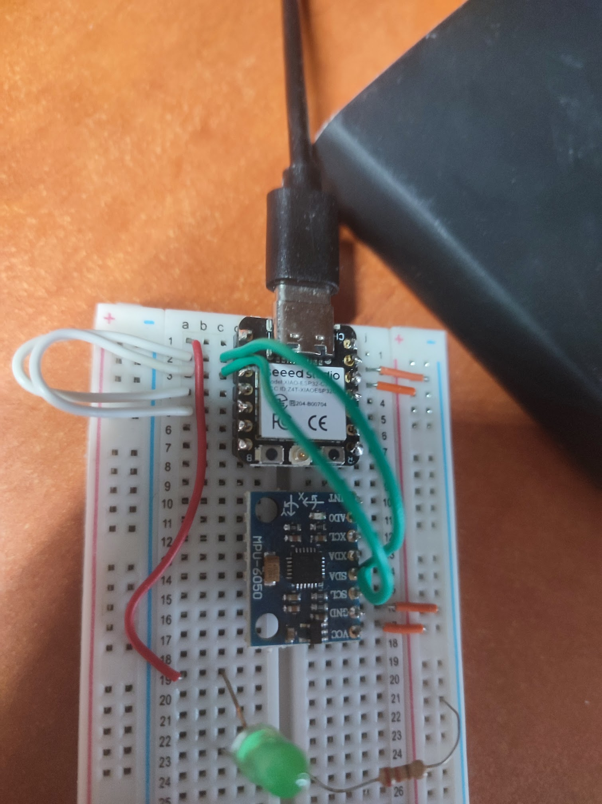

# esp32-i2c-gpio-bit-bang

## overview
Send/Receive information on I2C protocol using general purpose pins only. Temperature from MPU6050 was read.

- project is using internal pull-up ressistors (are set in init() method).
- https://invensense.tdk.com/wp-content/uploads/2015/02/MPU-6000-Datasheet1.pdf - i2c protocol described for MPU6050 
- https://www.ti.com/lit/an/sbaa565/sbaa565.pdf?ts=1765083604931 - basics of I2c in general page 13 example
- https://cdn.sparkfun.com/datasheets/Sensors/Accelerometers/RM-MPU-6000A.pdf - registers described
- paste `idf.py monitor` output to `plotter.py` to see the sda/scl chart - debugging tool

## how to run on Linux
Linux with docker installed are the prerequisites.
- Clone esp32 dev container template: `git clone https://github.com/bl2404/esp32-dev-container-template.git`
- Navigate to projects folder `cd esp32-dev-container-template\projects`
- Clone this proejct or add the submodule: `git add submodule https://github.com/bl2404/esp32-i2c-gpio-bit-bang.git`
- Follow build/flash instructions from the container's [readme.md](https://github.com/bl2404/esp32-dev-container-template/blob/main/README.md)

- circuit:

